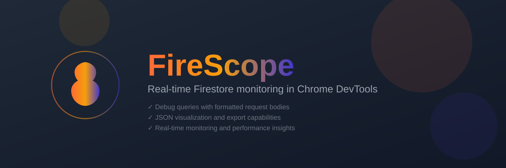

[](https://www.gnu.org/licenses/gpl-3.0.html)

<div align="center">

**A Chrome DevTools extension for real-time Firestore monitoring and debugging**

<p align="center">
  <a href="https://github.com/sponsors/omar-dulaimi">
    
  </a>
  <a href="https://github.com/omar-dulaimi/firescope">
    
  </a>
</p>

<p align="center">
  <a href="https://chrome.google.com/webstore"></a>
  <a href="https://developer.chrome.com/docs/extensions/mv3/intro/"></a>
  <a href="https://vitejs.dev/"></a>
  <a href="https://eslint.org/"></a>
</p>

_Visualize queries • Export code • Track collections • Debug in real-time_

</div>

---

## 🌟 Why FireScope?

Traditional Firestore debugging means digging through network tabs and deciphering cryptic request payloads. FireScope transforms this experience into something actually enjoyable.

**The Problem**: Firestore's document-based queries live in the stone age of browser debugging tools.

**The Solution**: A dedicated DevTools panel that speaks Firestore natively.

---

## ✨ Features

### 🔍 Real‑time Firestore Monitoring
- Captures Firestore network calls as you develop.
- Groups multiple queries in a single request under one card (Listen/channel).
- Shared stats per request: method, duration, status, count.

### 🧭 Clear Query Types
- Badges for FETCH, LOOKUP, WRITE, and AGG (aggregations).
- Collection Group (CG) badge when applicable.
- Doc lookups show paths like `Users/user_1` right in the summary.

### 📋 One‑click Code Export
- Angular (AngularFire), Node.js (Admin SDK), Flutter (cloud_firestore), and JSON.
- Works per request and per sub‑query in grouped requests.

### 🧩 Helpful Details (when you need them)
- Compact, readable JSON with collapsible sections.
- Aggregation summaries (COUNT/SUM/AVG) rendered per query.

### 🗂️ Collection Filtering & Utilities
- Filter by collection via search (Ctrl/Cmd+F) or the Collections menu.
- Export all visible requests, or clear the list quickly.

### 🎛️ Nice UX Touches
- Light/Dark/System themes (More menu).
- Non‑clipping dropdowns (portal) and keyboard-friendly search.
- Pro (optional): “View in Console” deep‑links queries/documents to Firebase Console.

---

## 📸 Screenshots

<div align="center">

|               Main Interface                |             Filtering — Part 1              |             Filtering — Part 2              |
| :-----------------------------------------: | :-----------------------------------------: | :-----------------------------------------: |
| 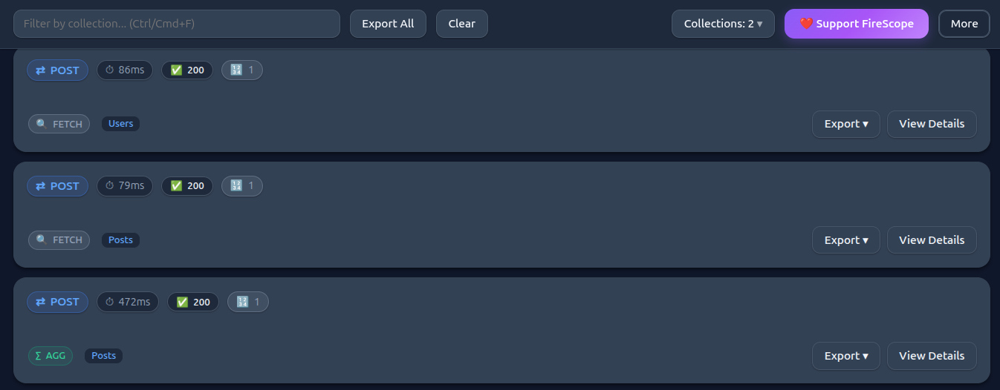 | 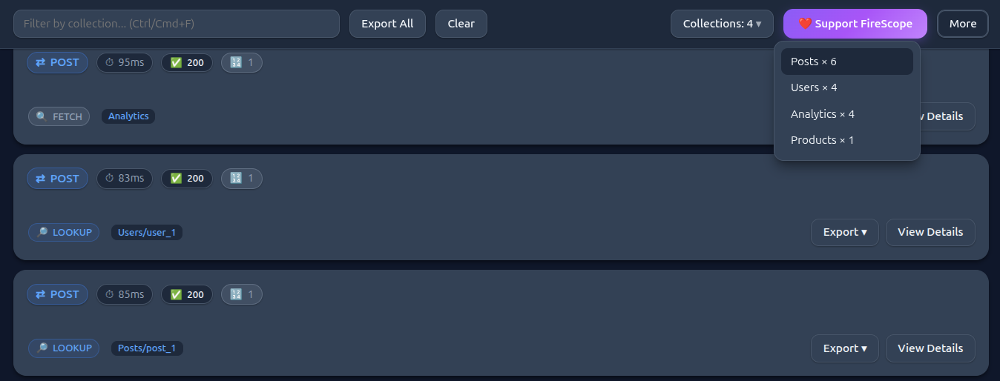 | 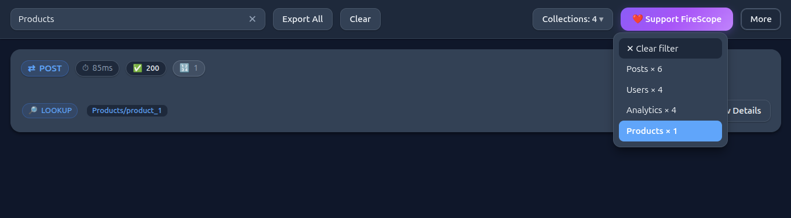 |

|                 Details View                |                 Code Export                 |                   More Menu                  |
| :-----------------------------------------: | :-----------------------------------------: | :-----------------------------------------: |
| 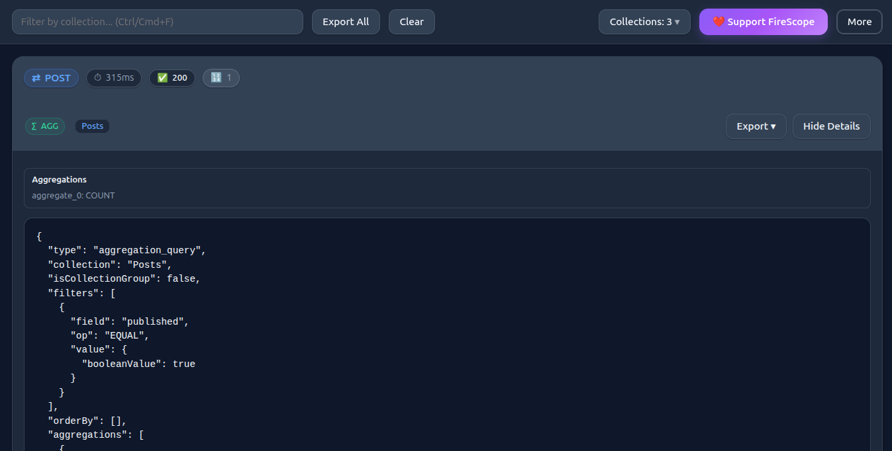 | 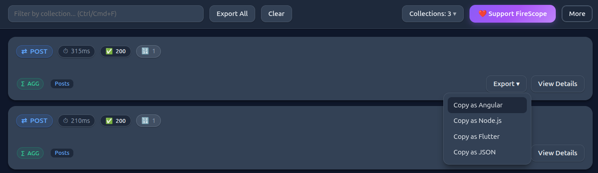 |  |

|                    Themes                   |              Grouped Requests               |                    —                        |
| :-----------------------------------------: | :-----------------------------------------: | :-----------------------------------------: |
| 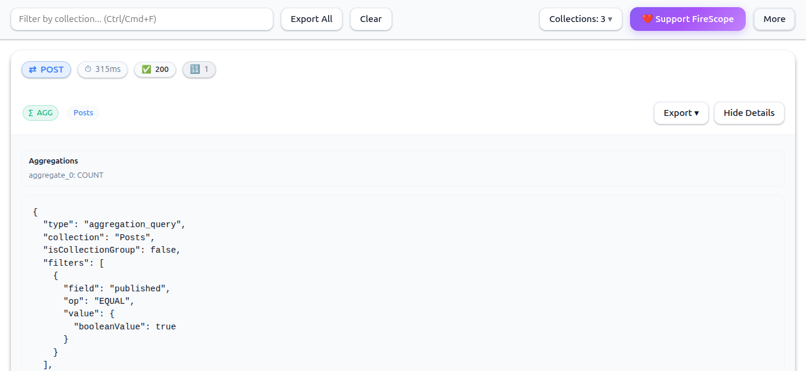 | 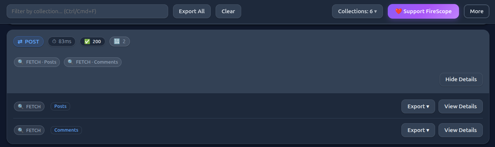 | _More screenshots coming soon_ |

</div>

---

## 🚀 Quick Start

### Option 1: Chrome Web Store (Recommended)

<p align="center">
  <a href="https://chromewebstore.google.com/detail/dpjiajgeckamnpncihnhldkehaghaffd">
    
  </a>
</p>

- Click the badge above or [Install FireScope from Chrome Web Store](https://chromewebstore.google.com/detail/dpjiajgeckamnpncihnhldkehaghaffd)
- Follow Chrome prompts to add the extension

### Option 2: Manual Install from GitHub Release

<p align="center">
  <a href="https://github.com/omar-dulaimi/firescope/releases/latest">
    
  </a>
</p>

- Download the latest release ZIP from [GitHub Releases](https://github.com/omar-dulaimi/firescope/releases/latest)
- Unzip the file
- Go to `chrome://extensions` and enable Developer Mode
- Click "Load unpacked" and select the unzipped folder

> **Note:** Release ZIPs will always contain the latest built extension files for easy installation.

---

## 💼 Pro Edition

- Adds a “View in Console” button to open the current query or document directly in Firebase Console.
- Requires an API key and a small backend that builds the console URL from minimal query info.
- Privacy: Only normalized query metadata is sent (collection path, filters/order, flags, project ID). No raw document data.
- Fast: Successful URLs are cached locally for 24h.

Setup (Pro)

1) Install the Pro build (ZIP) or build locally.
2) Open the extension Options page and paste your API key (stored in Chrome sync).
3) Click “View in Console” in the panel to jump to Firebase Console.

Build

- `pnpm build:free` → Free build (no Console button).
- `pnpm build:pro` → Pro build. Optional: `VITE_PRO_API_BASE=https://your-backend`.
- `pnpm build:both` → Produces `firescope.zip` and `firescope-pro.zip`.

Permissions (Pro)

- `storage` for key + cache.
- Host permission for your backend (configured in the Pro manifest).

Notes

- The server builds Console URLs so logic stays private and can evolve without client updates.
- To purchase a Pro API key, please contact me: https://github.com/omar-dulaimi

### How Pro Works (Sequence)

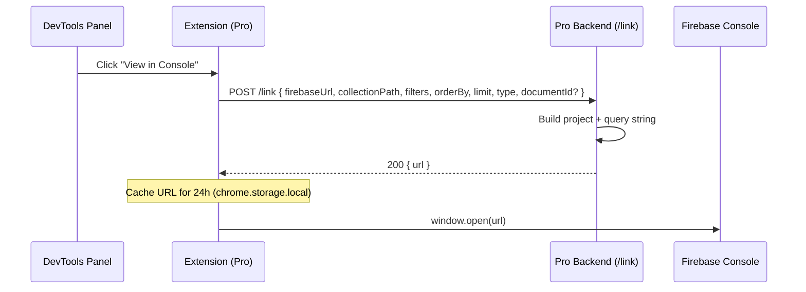

Behavior

- Document lookup (LOOKUP): opens the exact document page in Firebase Console.
- Structured / collection(-group) queries: opens the Console query builder with filters, ordering, and limit prefilled.

### Pro Error Paths (Sequence)

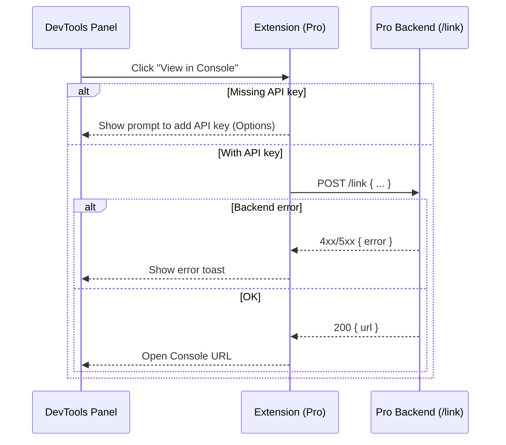

### Option 3: Build from Source

```bash
# Clone and setup
git clone https://github.com/omar-dulaimi/firescope.git
cd firescope
pnpm install

# Build for production
pnpm run build

# Or start development
pnpm run build:dev    # Quick development build
pnpm run build:watch  # Auto-rebuild on changes
```

- After building, load the `dist` folder in Chrome via Developer Mode (chrome://extensions → Load unpacked)

---

## 📖 Usage Guide

### 🎯 **Getting Started**

1. **Open DevTools** → Press `F12` or right-click → _Inspect Element_
2. **Find FireScope** → Look for the "FireScope" tab in DevTools
3. **Visit your app** → Navigate to any page with Firestore queries
4. **Watch magic happen** → Requests appear in real-time!

### 🔥 **Power Features**

#### Code Export Workflow

1) Click any request → Export ▾ → choose your target.

Angular (AngularFire)

```ts
// AngularFire example
import { Firestore, collection, query, where, orderBy, getDocs } from '@angular/fire/firestore';

const ref = collection(firestore, 'Users');
let qRef = ref;
qRef = query(qRef, where('status', '==', 'active'));
qRef = query(qRef, orderBy('createdAt', 'asc'));
const snap = await getDocs(qRef);
console.log(snap.docs.map(d => ({ id: d.id, ...d.data() })));
```

Node.js (Admin SDK)

```js
// Node.js Admin SDK example
const db = admin.firestore();
let ref = db.collection('Users');
const queryRef = ref
  .where('status', '==', 'active')
  .orderBy('createdAt', 'asc');
const snap = await queryRef.get();
console.log(snap.docs.map(d => ({ id: d.id, ...d.data() })));
```

Flutter (cloud_firestore)

```dart
// Flutter Firestore example
final ref = FirebaseFirestore.instance.collection('Users');
var queryRef = ref
  .where('status', isEqualTo: 'active')
  .orderBy('createdAt', descending: false);
final snap = await queryRef.get();
print(snap.docs.map((d) => d.data()));
```

#### Collection Analytics

- Click **"Collections"** to see your database access patterns
- Discover which collections are hit most frequently
- Identify potential optimization opportunities

---

## 🏗️ **Modern Architecture**

Built with cutting-edge tools for the best developer experience:

<div align="center">

| Technology            | Purpose            | Why We Use It                                 |
| --------------------- | ------------------ | --------------------------------------------- |
| **⚡ Vite**           | Build System       | Lightning-fast HMR and optimized builds       |
| **🔍 ESLint**         | Code Quality       | Modern config with automatic error detection  |
| **💅 Prettier**       | Code Formatting    | Consistent, beautiful code across the project |
| **📦 Manifest V3**    | Extension Platform | Latest Chrome extension standards             |
| **🧪 Modular Design** | Architecture       | Clean separation of concerns                  |

</div>

---

## 🛠️ Development

### 📋 **Prerequisites**

- **Node.js 20+** with pnpm
- **Chrome 88+** (Manifest V3 support)
- **Git** for version control

### ⚡ **Development Commands**

```bash
# 🔧 Development
pnpm run dev              # Start dev server (port 8080)
pnpm test                 # Run tests in browser
pnpm run lint             # Check code quality
pnpm run format           # Format with Prettier

# 🏗️ Building
pnpm run build            # Production build (lint + validate + build)
pnpm run build:dev        # Fast development build
pnpm run build:watch      # Auto-rebuild on file changes
pnpm run build:clean      # Clean dist/ directory

# 🎮 Demo & Testing
pnpm run demo:website     # Start demo site (port 3000)
pnpm run demo:seed        # Populate demo database
```

### 🔎 Supported Query Types

- Document Lookup
  - Open a specific document by path (e.g., `Users/user_1`).
  - Shows as LOOKUP; in Pro, deep-link to Console for that doc.

- Structured Query (Collection)
  - Filters: `==`, `!=`, `<`, `<=`, `>`, `>=`, `in`, `not-in`, `array-contains`, `array-contains-any`.
  - Ordering: multiple `orderBy` clauses.
  - Limit: supports numeric `limit`.

- Collection Group Query
  - Same operators as structured queries, across subcollections (`collectionGroup`).

- Aggregation Query
  - COUNT, SUM(field), AVG(field).
  - Displays an aggregation summary and exports to code.

- Batched in One Request
  - Multiple queries can arrive in the same Listen request; FireScope groups them under one card with per-query chips and actions.

### 🔄 **Development Workflow**

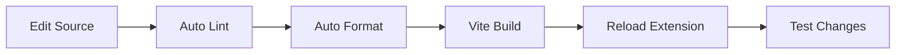

1. **Edit** files in `src/` directory
2. **Build** with `pnpm run build` (includes linting & validation)
3. **Reload** extension at `chrome://extensions/`
4. **Test** on any Firestore-enabled website

---

## 🔐 Privacy & Permissions

### 🛡️ **What We Access**

- **webRequest**: Monitor Firestore API calls (`firestore.googleapis.com`)
- **Host permissions**: Access to your domains for request interception

### ✅ **Privacy Commitment**

<div align="center">

| ❌ **We DON'T**               | ✅ **We DO**                    |
| ----------------------------- | ------------------------------- |
| Send data to external servers | Process everything locally      |
| Store personal information    | Respect your privacy            |
| Track your usage              | Keep data in your browser       |
| Access unrelated browser data | Only monitor Firestore requests |
| Modify your Firestore data    | Read-only monitoring            |

</div>

**100% Local Processing** - All monitoring happens in your browser. Zero data leaves your machine.

---

## 🔧 Troubleshooting

<details>
<summary><strong>🚨 Extension not appearing in DevTools</strong></summary>

1. Ensure extension is **enabled** at `chrome://extensions/`
2. **Developer mode** must be enabled
3. **Refresh** the page and reopen DevTools
4. Check Chrome version (need 88+ for Manifest V3)

</details>

<details>
<summary><strong>📭 No requests showing up</strong></summary>

1. Verify the website uses Firestore (check Network tab for `firestore.googleapis.com`)
2. Check **browser console** for extension errors
3. Ensure you're on the **correct tab**
4. Try the demo: `pnpm run demo:website`

</details>

<details>
<summary><strong>🐌 Performance issues</strong></summary>

1. **Clear old requests** using the clear button
2. **Adjust max requests** in Settings (default: 50)
3. Use **filtering** to reduce visible requests
4. Close unused DevTools tabs

</details>

<details>
<summary><strong>🛠️ Development issues</strong></summary>

1. **Build errors**: Run `pnpm run lint` to check syntax
2. **Tests failing**: Use `pnpm test` for browser test runner
3. **Demo not working**: Configure `.env` with Firebase credentials
4. **Vite issues**: Clear `node_modules` and reinstall

</details>

---

## 🤝 Contributing

We welcome contributions! Here's how to get started:

```bash
# 1. Fork the repository
# 2. Clone your fork

# 3. Create a feature branch
git checkout -b feature/amazing-feature

# 4. Make changes and test
pnpm run lint        # Check code quality
pnpm run format      # Format code
pnpm test           # Run tests

# 5. Commit and push
git commit -m "Add amazing feature"
git push origin feature/amazing-feature

# 6. Open a Pull Request
```

---

## 📄 License

This project is licensed under the GNU General Public License v3.0 (GPL-3.0). Any derivative work or redistribution must also be licensed under GPL-3.0. See LICENSE for details.

<div align="center">

**🔥 Made with ❤️ for the Firebase community**

_Star this repo if FireScope helps you debug faster! ⭐_

</div>
